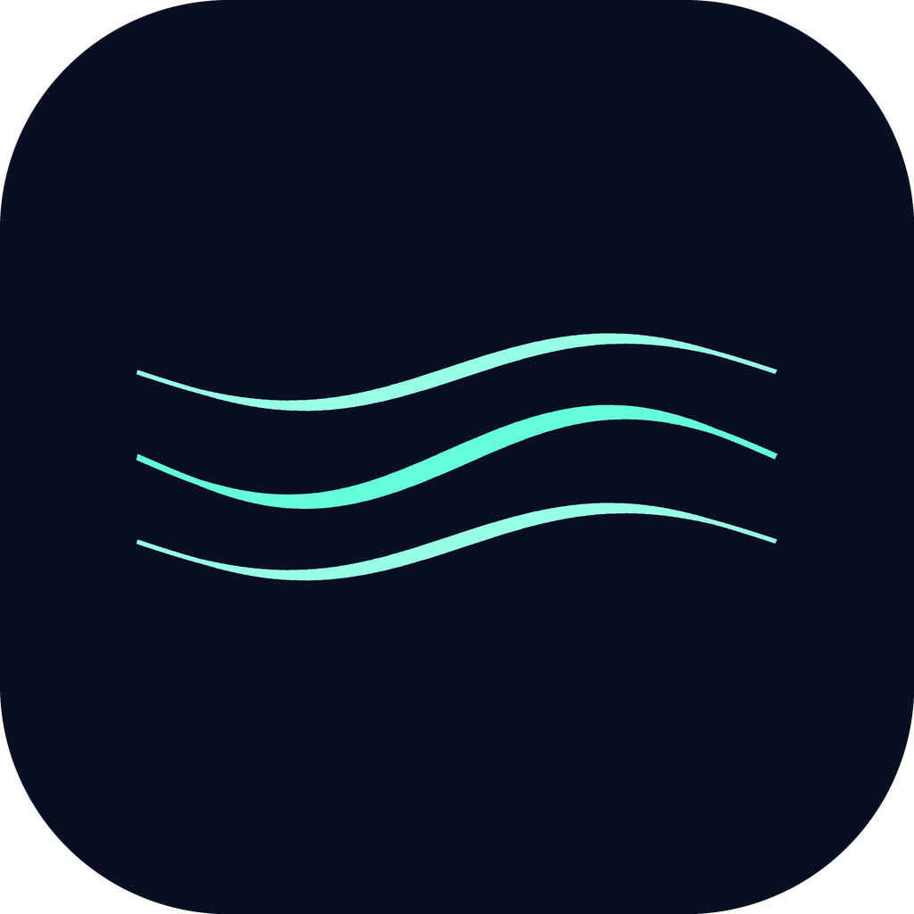
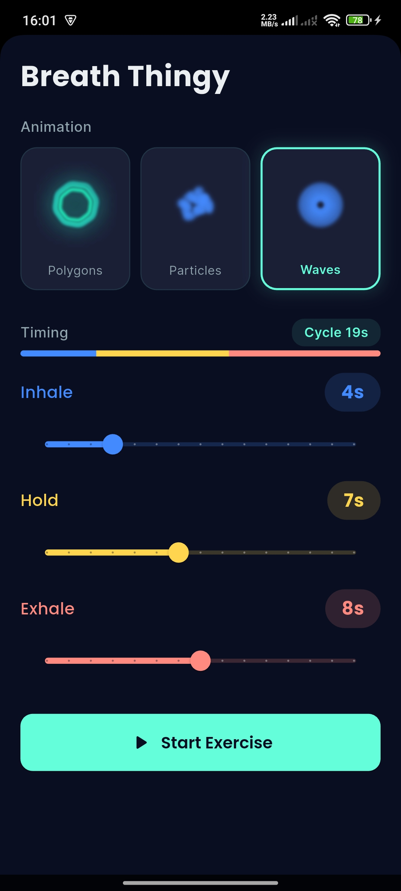
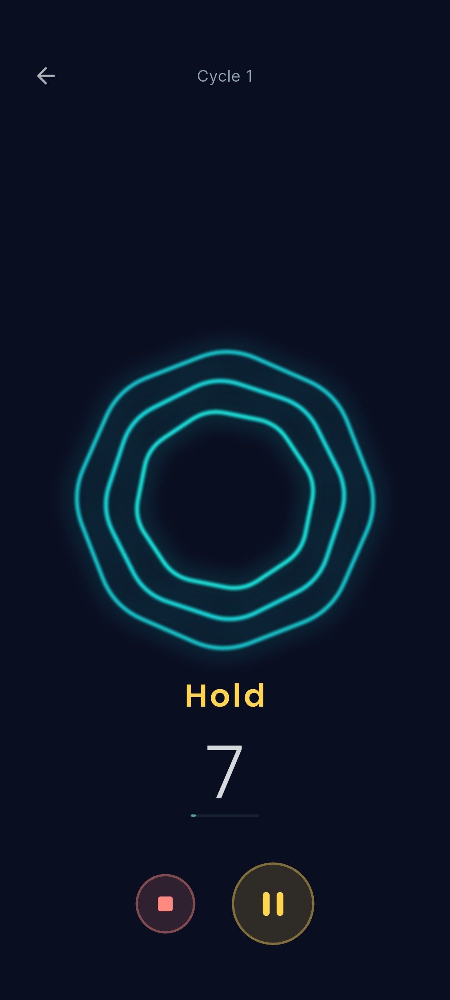
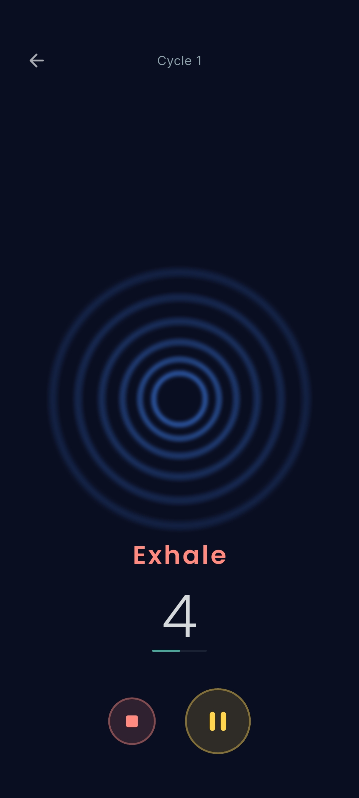

<p align="center">
  
</p>

<h1 align="center">Breath Thingy</h1>

<p align="center">
  
  
  
  
  
</p>

<p align="center">
  A simple, free, open-source breathing exercise app. No ads, no subscriptions, no tracking. Just breathe.
</p>

> **Platform note:** Only Android has been tested. iOS and Web should work without issues since the app uses only cross-platform APIs, but they haven't been verified yet.

## Why?

Every breathing app out there is either paid, full of ads, or ugly. This one is none of those.

You configure your inhale/hold/exhale times, pick an animation, and start breathing. That's it.

## Features

- **3 custom animations** synced to your breathing rhythm, all built with CustomPainter at 60fps:
  - **Polygon Morph** - A shape that grows in sides and radius as you inhale, holds with a pulsing glow, and shrinks back as you exhale
  - **Particle Convergence** - 80 particles that gather into a circle on inhale, orbit with constellation lines on hold, and scatter on exhale
  - **Ripple Rings** - Concentric rings that contract inward on inhale, pulse organically on hold, and expand outward on exhale
- **Configurable timings** - Inhale, hold, and exhale durations from 1 to 15 seconds each
- **Continuous cycles** - The app loops inhale > hold > exhale indefinitely until you stop
- **Pause/resume** - Pause mid-breath without losing your place
- **Persistent settings** - Your config is saved locally and restored on next launch
- **Dark theme** - Easy on the eyes, designed for relaxation
- **Fullscreen immersive mode** - No distractions during the exercise
- **12 languages** - Auto-detects device language (see [Supported Languages](#supported-languages))

## Screenshots

<p align="center">
  
  &nbsp;&nbsp;
  
  &nbsp;&nbsp;
  
</p>

## Getting Started

### Prerequisites

- [Flutter](https://docs.flutter.dev/get-started/install) 3.38+ (stable channel)
- Dart SDK 3.10+

### Setup

```bash
# Clone the repo
git clone https://github.com/daniel-pimenta-cc/breath_thingy.git
cd breath_thingy

# Install dependencies
flutter pub get

# Generate Freezed/Riverpod code
dart run build_runner build --delete-conflicting-outputs

# Run
flutter run
```

### Build

```bash
# Android
flutter build apk

# iOS
flutter build ios

# Web
flutter build web
```

## Project Structure

```
lib/
  main.dart                          # Entry point
  app.dart                           # MaterialApp setup
  core/
    theme/                           # Dark theme, color palette
    router/                          # GoRouter navigation
    constants/                       # Animation & breathing defaults
    utils/                           # Duration formatting
  features/
    breathing/
      domain/
        models/                      # BreathingConfig, BreathingPhase, BreathingSession (Freezed)
        repositories/                # Repository interface
      data/
        repositories/                # SharedPreferences implementation
      presentation/
        screens/                     # HomeScreen, BreathingScreen
        widgets/                     # DurationPicker, PhaseIndicator, TimerDisplay, Controls
        providers/                   # Riverpod state management
      animations/
        base/                        # AnimationPhaseController, base painter/widget
        painters/                    # CustomPainter for each animation
        widgets/                     # Widget wrappers + AnimationSwitcher factory
```

## Tech Stack

| Layer | Tech |
|-------|------|
| State management | Riverpod + `@riverpod` codegen |
| Navigation | GoRouter |
| Persistence | SharedPreferences |
| Models | Freezed + json_serializable |
| Animations | CustomPainter (no external deps) |
| Typography | Google Fonts (Poppins + Inter) |

## Supported Languages

| Language | Locale | Status |
|----------|--------|--------|
| Português | pt | Verified |
| English | en | Verified |
| Español | es | AI-translated |
| Français | fr | AI-translated |
| Italiano | it | AI-translated |
| Deutsch | de | AI-translated |
| Nederlands | nl | AI-translated |
| Türkçe | tr | AI-translated |
| Русский | ru | AI-translated |
| 日本語 | ja | AI-translated |
| 한국어 | ko | AI-translated |
| 中文 | zh | AI-translated |

> **Note:** Only Portuguese and English have been manually verified. All other translations were generated using AI and may contain inaccuracies. If you're a native speaker and spot an error, PRs are welcome!

## How It Works

The core of the app is the `AnimationPhaseController`, which chains three `AnimationController`s (one per phase) using `async/await` with `forward().orCancel`. Each CustomPainter receives this controller as its repaint listenable, so frames are only painted when values change.

The breathing session is a state machine:

```
idle --> running(inhale) --> running(hold) --> running(exhale) --> running(inhale) ...
              |                    |                  |
              +-----> paused <-----+------------------+
                        |
                        +--> running (resume)

running/paused --> completed --> idle (reset)
```

## Contributing

Contributions are welcome! Please read [CONTRIBUTING.md](CONTRIBUTING.md) for guidelines on how to get started.

Some ideas for contributions:

- New animations (the architecture makes it easy - just add a painter + widget)
- Sound/haptic feedback on phase changes
- Preset breathing patterns (4-7-8, box breathing, etc.)
- Session history/statistics
- Fix or improve AI-generated translations

## License

MIT License. See [LICENSE](LICENSE) for details.
